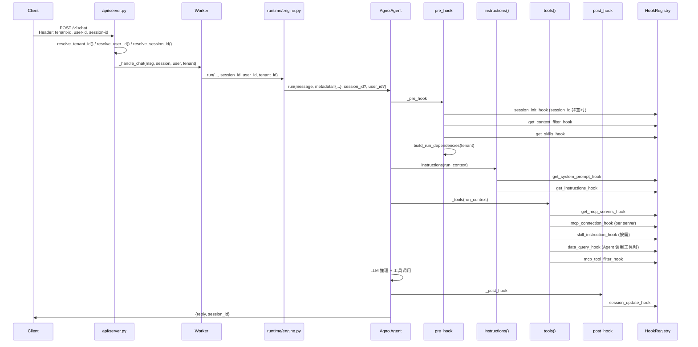

基于 Agno/hook/Mysql数据库，构建通用型 Agent 系统，需要实现以下功能：  

1. 动态钩子函数系统
  设计并实现以下钩子函数接口：  
   a) Prompt 动态组装钩子：  
      - get_system_prompt_hook(run_context, session_state) -> str  
      - get_instructions_hook(run_context, user_profile) -> str  
      - get_context_filter_hook(run_context) -> Dict  
   b) MCP 动态连接钩子：  
      - get_mcp_servers_hook(run_context, business_scenario) -> List[MCPServerConfig]  
      - mcp_tool_filter_hook(run_context, available_tools) -> List[Tool]  
      - mcp_connection_hook(server_config) -> None  
   c) Skills 动态加载钩子：  
      - get_skills_hook(run_context, user_requirements) -> List[Skill]  
      - skill_instruction_hook(skill_name, run_context) -> str  
      - skill_script_hook(script_name, run_context) -> Any  
   d) 数据源钩子：  
      - get_db_connection_hook(run_context) -> DBConnection  
      - data_query_hook(query, run_context) -> str  
      - result_processing_hook(results, run_context) -> Dict  
   e) 会话管理钩子：  
      - session_init_hook(session_id, user_context) -> None  
      - session_update_hook(session_state, run_context) -> Dict  
      - session_cleanup_hook(session_id) -> None
2. 钩子函数加载机制
  - 当前先完成功能开发，最终需要做成镜像，因此这些函数最终能够通过 PVC 挂载出来，以实现动态加载 Python 模块
3. 动态 Agent 构建器
  - 基于钩子函数返回值动态配置 Agent 实例  
  - 实时更新 tools、instructions、knowledge 等组件
4. 执行流程集成
  实现 Agent 执行流程：  
   用户请求 → pre_hooks执行 → 动态指令生成 → MCP工具动态加载 →  Skills动态加载 → Agent执行 → post_hooks执行 → 响应返回
5. Docker 部署支持
  - 设计 Docker 镜像结构  
  - 配置 PVC 挂载点用于钩子函数代码  
  - 支持环境变量配置钩子函数目录  
  - 实现健康检查和监控端点

技术规范：  

- 使用 Agno SDK 的 Agent、pre_hooks、post_hooks 机制  
- 利用 callable instructions 实现动态提示词  
- 使用 MCPTools 集成外部 MCP 服务器  
- 利用 Skills 系统提供领域专业知识  
- 实现自定义 knowledge retriever 连接 MySQL  
- 遵循 Agno 的 RunContext 和会话管理模式


# Agno Worker Hook 执行链路

本文档说明 `agno_worker` 中租户级动态智能体的 Hook 机制：入口、租户 ID 传递路径、全部 Hook 定义与调用时机，以及 Hook 与 AgentSpec 的合并策略。

---


## 1. 总体架构

```
HTTP 请求 (/v1/chat)
    │
    ▼
api/server.py          ← 解析 tenant-id / user-id / session-id 请求头
    │
    ▼
worker.py              ← _handle_chat → runtime.run()
    │
    ▼
runtime/engine.py      ← 写入 run_context.metadata（tenant_id / user_id / session_id）
    │
    ▼
Agno Agent.run()
    │
    ├─ pre_hooks       ← AgentBuilder._make_pre_hook()
    ├─ instructions()  ← 动态 Prompt（Hook + AgentSpec）
    ├─ tools()         ← 动态 MCP / Skills / Data 工具
    ├─ Agent 推理执行
    └─ post_hooks      ← AgentBuilder._make_post_hook()
```

核心设计：**只构建一个动态 Agent**，每次 `run()` 通过 Hook 按租户/会话/角色实时决定 Prompt、工具、知识库过滤条件等，AgentSpec 仅作 fallback 角色目录。

---


## 2. 入口与调用链


### 2.1 HTTP 入口


| 端点              | 文件              | 说明                                     |
| --------------- | --------------- | -------------------------------------- |
| `POST /v1/chat` | `api/server.py` | 主对话入口，解析身份/会话后调用 `Worker._handle_chat` |
| `GET /status`   | `api/server.py` | 返回 Hook 加载来源、指纹等运行时状态                  |
| `GET /health`   | `api/server.py` | 健康检查                                   |


### 2.2 Hook 注册表入口


| 组件             | 文件                   | 说明                                                                           |
| -------------- | -------------------- | ---------------------------------------------------------------------------- |
| `HookRegistry` | `hooks/registry.py`  | 从 PVC 目录加载全部 Hook，统一 `call(name, *args)` 调度                                  |
| `AgentBuilder` | `runtime/builder.py` | 将 Hook 注入 Agno Agent 的 `pre_hooks` / `post_hooks` / `instructions` / `tools` |
| `AgnoRuntime`  | `runtime/engine.py`  | 构建 Agent，在 `run()` 时把 HTTP 解析结果写入 metadata / run kwargs                      |


### 2.3 Worker 启动流程

```
Worker.start()
  → HookRegistry(hooks_dir)     # 启动时加载，缺任一 Hook 则 fail-fast
  → AgnoRuntime.build()
  → AgentBuilder.build_dynamic_agent()
  → AgnoAPIServer 监听 HTTP
  → _watch_loop()               # 每 30s 检测 Hook/AgentSpec 文件变更并热重载
```

Hook 目录默认：`/etc/hiclaw/hooks`（环境变量 `AGNO_HOOKS_DIR`）。

---


## 3. HTTP 身份与会话解析


### 3.1 租户 ID（tenant_id）

文件：`api/identity.py`

```python
TENANT_ID_HEADERS = ("tenant-id", "x-tenant-id")
```

优先级（高 → 低）：

1. **请求头**：`tenant-id` 或 `x-tenant-id`（与 aip-hub `WebFrameworkUtils` 对齐）
2. **Query 参数**：`?tenant_id=...`

对应代码路径：

```
api/server.py::chat()
  → resolve_tenant_id(
        headers=request.headers,
        query_tenant_id=request.query_params.get("tenant_id"),
    )
  → Worker._handle_chat(..., tenant_id)
  → AgnoRuntime.run(..., tenant_id=tenant_id)
```


### 3.2 用户 ID（user_id）

文件：`api/identity.py`

```python
USER_ID_HEADERS = ("user-id", "x-user-id")
```

优先级（高 → 低）：

1. **请求头**：`user-id` 或 `x-user-id`
2. **请求体**：`{"user_id": "..."}`（可选，兼容旧调用方）
3. **Query 参数**：`?user_id=...`

对应代码路径：

```
api/server.py::chat()
  → resolve_user_id(
        body_user_id=req.user_id,
        headers=request.headers,
        query_user_id=request.query_params.get("user_id"),
    )
  → AgnoRuntime.run(..., user_id=user_id)
```


### 3.3 会话 ID（session_id）

文件：`api/identity.py`

```python
SESSION_ID_HEADERS = ("session-id", "x-session-id")
```

优先级（高 → 低）：

1. **请求头**：`session-id` 或 `x-session-id`
2. **Query 参数**：`?session_id=...`

**不在请求体中传递**（`ChatRequest` 仅含 `message` 与可选 `user_id`）。

对应代码路径：

```
api/server.py::chat()
  → resolve_session_id(
        headers=request.headers,
        query_session_id=request.query_params.get("session_id"),
    )
  → Worker._handle_chat(..., session_id)
  → AgnoRuntime.run(..., session_id=session_id)
  → ChatResponse(session_id=resolved_session_id)
```

未解析到 `session_id` 时的行为：

1. `AgnoRuntime.run()` **不向** Agno 传入 `session_id` 参数（避免传入空字符串）
2. Agno SDK `initialize_session()` 自动生成 `uuid4()` 作为会话 ID
3. `RunOutput.session_id` 回传至 `ChatResponse.session_id`，客户端应在后续请求 Header 中带回以续聊
4. `pre_hook` 通过 `_extract_session_id(session, run_context)` 优先从 Agno `session` 对象读取；若仍为空则跳过 `session_init_hook`

请求示例：

```bash
curl -X POST http://localhost:8090/v1/chat \
  -H "Content-Type: application/json" \
  -H "Authorization: Bearer <token>" \
  -H "session-id: conv-123" \
  -H "user-id: alice" \
  -H "tenant-id: t-001" \
  -d '{"message": "你好"}'
```


### 3.4 写入 RunContext

文件：`runtime/engine.py`

```python
run_metadata = dict(metadata or {})
kwargs = {"metadata": run_metadata}
if session_id:
    run_metadata["session_id"] = session_id
    kwargs["session_id"] = session_id
if user_id:
    run_metadata["user_id"] = user_id
    kwargs["user_id"] = user_id
if tenant_id:
    run_metadata["tenant_id"] = tenant_id
response = target.run(message, **kwargs)
resolved_session_id = response.session_id or session_id
return reply, resolved_session_id
```

此后 Hook 通过以下方式读取租户 ID：


| 读取位置                | 路径                                                      |
| ------------------- | ------------------------------------------------------- |
| 直接读 metadata        | `run_context.metadata["tenant_id"]`                     |
| 读 dependencies      | `run_context.dependencies["tenant"]["tenant_id"]`       |
| 读 user_profile      | `run_context.dependencies["user_profile"]["tenant_id"]` |
| 读 knowledge_filters | `run_context.knowledge_filters.get("tenant_id")`        |


### 3.5 dependencies 组装

文件：`hooks/compose.py::build_run_dependencies()`

在 `pre_hook` 阶段执行，将 metadata 与 knowledge_filters 合并：

```python
tenant_id = metadata.get("tenant_id") or knowledge_filters.get("tenant_id") or ""
run_context.dependencies = {
    "tenant": {
        "tenant_id": str(tenant_id),
        "knowledge_ids": [...],
        "provider": "weknora",
    },
    "user_profile": {
        "user_id": "...",
        "tenant_id": "...",
    },
}
```

**注意**：Hook 也可在 `get_context_filter_hook` 返回值中设置 `tenant_id`，会进入 `knowledge_filters` 并参与上述合并。

---


## 4. Hook 加载机制


### 4.1 模块扫描顺序

`HookRegistry` 按以下文件名顺序查找 Hook 实现（找到即停）：

```
hooks.py → prompt.py → mcp.py → skills.py → session.py → data.py → __init__.py
```

每个模块内以**同名函数**导出，例如 `prompt.py` 中定义 `get_system_prompt_hook`。

### 4.2 必须实现的 Hook（15 个）

启动时 **全部必须存在**，否则抛出 `HookLoadError` 并拒绝启动：


| #   | Hook 名称                   | 协议分组    |
| --- | ------------------------- | ------- |
| 1   | `get_system_prompt_hook`  | Prompt  |
| 2   | `get_instructions_hook`   | Prompt  |
| 3   | `get_context_filter_hook` | Prompt  |
| 4   | `get_mcp_servers_hook`    | MCP     |
| 5   | `mcp_tool_filter_hook`    | MCP     |
| 6   | `mcp_connection_hook`     | MCP     |
| 7   | `get_skills_hook`         | Skills  |
| 8   | `skill_instruction_hook`  | Skills  |
| 9   | `skill_script_hook`       | Skills  |
| 10  | `get_db_connection_hook`  | Data    |
| 11  | `data_query_hook`         | Data    |
| 12  | `result_processing_hook`  | Data    |
| 13  | `session_init_hook`       | Session |
| 14  | `session_update_hook`     | Session |
| 15  | `session_cleanup_hook`    | Session |


接口定义见 `hooks/protocols.py`。

### 4.3 热重载

`Worker._watch_loop()` 对 Hook 目录做 SHA256 指纹比对，变更时调用 `AgnoRuntime.reload_hooks()` 重新 import 并重建 Agent。

---


## 5. 单次对话执行流程




---


## 6. 全部 Hook 详解


### 6.1 Prompt 类（3 个）


#### `get_system_prompt_hook(run_context, session_state) -> str`


| 属性           | 值                                          |
| ------------ | ------------------------------------------ |
| **调用时机**     | 每次生成 instructions 时                        |
| **调用位置**     | `runtime/builder.py::_make_instructions()` |
| **作用**       | 返回租户/角色级 System Prompt                     |
| **Fallback** | AgentSpec 当前角色的 `role` 字段                  |
| **合并规则**     | Hook 返回非空字符串则覆盖 Spec                       |


#### `get_instructions_hook(run_context, user_profile) -> str`


| 属性                  | 值                                                                     |
| ------------------- | --------------------------------------------------------------------- |
| **调用时机**            | 每次生成 instructions 时                                                   |
| **调用位置**            | `runtime/builder.py::_make_instructions()`                            |
| **作用**              | 返回用户/租户相关的补充指令                                                        |
| **入参 user_profile** | 来自 `run_context.dependencies["user_profile"]`，含 `tenant_id`、`user_id` |
| **Fallback**        | AgentSpec 当前角色的 `instructions` 字段                                     |


#### `get_context_filter_hook(run_context) -> dict`


| 属性           | 值                                                                        |
| ------------ | ------------------------------------------------------------------------ |
| **调用时机**     | pre_hook 阶段（最早的数据面 Hook）                                                 |
| **调用位置**     | `runtime/builder.py::_make_pre_hook()`                                   |
| **作用**       | 设置知识库检索过滤条件，写入 `run_context.knowledge_filters`                           |
| **期望返回格式**   | `{"tenant_id": "...", "provider": "weknora", "knowledge_ids": ["kb-1"]}` |
| **Fallback** | AgentSpec 角色的 `knowledge` 配置                                             |


---


### 6.2 MCP 类（3 个）


#### `get_mcp_servers_hook(run_context, business_scenario) -> list[MCPServerConfig]`


| 属性                    | 值                                                       |
| --------------------- | ------------------------------------------------------- |
| **调用时机**              | 每次解析 tools 时                                            |
| **调用位置**              | `runtime/builder.py::_make_tools()`                     |
| **作用**                | 按租户/场景返回 MCP 服务器列表                                      |
| **business_scenario** | 默认取 `metadata["business_scenario"]`，否则为当前 `active_role` |
| **Fallback**          | Hook 为空时不加载 MCP（Spec 中 `tools` 字段仅为声明，不自动加载）            |


#### `mcp_connection_hook(server_config) -> None`


| 属性       | 值                                  |
| -------- | ---------------------------------- |
| **调用时机** | 每个 MCP Server 实例化前                 |
| **调用位置** | `mcp/loader.py::build_mcp_tools()` |
| **作用**   | 连接前钩子（鉴权、env 注入、连接预热等）             |


#### `mcp_tool_filter_hook(run_context, available_tools) -> list`


| 属性           | 值                                   |
| ------------ | ----------------------------------- |
| **调用时机**     | 所有工具组装完成后                           |
| **调用位置**     | `runtime/builder.py::_make_tools()` |
| **作用**       | 按租户过滤/裁剪最终工具列表（MCP + Skills + Data） |
| **Fallback** | 返回 `None` 时使用原列表                    |


---


### 6.3 Skills 类（3 个）


#### `get_skills_hook(run_context, user_requirements) -> list`


| 属性       | 值                                      |
| -------- | -------------------------------------- |
| **调用时机** | pre_hook + tools 解析（catalog 为空时）       |
| **调用位置** | `skills/manager.py::resolve_catalog()` |
| **作用**   | 返回当前 run 可用的 Skill 元数据列表               |
| **缓存**   | 按 `{tenant_id}                         |


#### `skill_instruction_hook(skill_name, run_context) -> str`


| 属性       | 值                                     |
| -------- | ------------------------------------- |
| **调用时机** | Agent 调用 `get_skill_instructions` 工具时 |
| **调用位置** | `skills/manager.py`                   |
| **作用**   | 按需加载 Skill 完整指令正文                     |


#### `skill_script_hook(skill_name, script_name, run_context, *, execute=False) -> Any`


| 属性       | 值                                   |
| -------- | ----------------------------------- |
| **调用时机** | Agent 调用 `get_skill_script` 工具时     |
| **调用位置** | `skills/manager.py`                 |
| **作用**   | 读取或执行 Skill 脚本（`execute=True` 时不缓存） |


---


### 6.4 Data 类（3 个）


#### `get_db_connection_hook(run_context) -> DBConnection`


| 属性       | 值                                         |
| -------- | ----------------------------------------- |
| **调用时机** | ⚠️ **当前框架未主动调用**（仅要求加载）                   |
| **协议定义** | `hooks/protocols.py`                      |
| **预期用途** | 租户级 DB 连接配置，供 `data_query_hook` 内部或未来扩展使用 |


#### `data_query_hook(query, run_context) -> Any`


| 属性       | 值                               |
| -------- | ------------------------------- |
| **调用时机** | Agent 调用 `query_mysql_data` 工具时 |
| **调用位置** | `data/mysql_provider.py`        |
| **作用**   | 执行租户数据查询                        |


#### `result_processing_hook(results, run_context) -> dict`


| 属性       | 值                                |
| -------- | -------------------------------- |
| **调用时机** | `data_query_hook` 返回后立即调用        |
| **调用位置** | `data/mysql_provider.py`         |
| **作用**   | 格式化查询结果，期望含 `{"text": "..."}` 字段 |


---


### 6.5 Session 类（3 个）


#### `session_init_hook(session_id, user_context) -> None`


| 属性               | 值                                      |
| ---------------- | -------------------------------------- |
| **调用时机**         | 每次 run 的 pre_hook 开头                   |
| **调用位置**         | `runtime/builder.py::_make_pre_hook()` |
| **user_context** | `{"user_id", "session_id"}`            |
| **作用**           | 会话初始化（外部存储、租户上下文绑定等）                   |


#### `session_update_hook(session_state, run_context) -> dict`


| 属性       | 值                                                          |
| -------- | ---------------------------------------------------------- |
| **调用时机** | 每次 run 的 post_hook                                         |
| **调用位置** | `runtime/builder.py::_make_post_hook()`                    |
| **作用**   | 返回 dict 合并进 `run_context.session_state`（如切换 `active_role`） |


#### `session_cleanup_hook(session_id) -> None`


| 属性       | 值                       |
| -------- | ----------------------- |
| **调用时机** | ⚠️ **当前框架未主动调用**（仅要求加载） |
| **预期用途** | 会话销毁/过期清理               |


---


## 7. Hook 与 AgentSpec 合并策略

文件：`hooks/compose.py`

```python
def has_hook_data(value):
    # None → False
    # "" → False
    # 非空 str / dict / list → True

def pick_hook_or_spec(hook_value, spec_value):
    # Hook 有数据 → 用 Hook
    # 否则 → 用 AgentSpec fallback
```

**角色选择**：`session_state["active_role"]` → `role` → `phase` → `agent`，均需在 `spec.agents` 中存在，否则用第一个角色。

---


## 8. RunContext 关键字段（Hook 开发者参考）

Hook 函数收到的 `run_context` 是 Agno SDK 的 RunContext，pre_hook 执行后包含：


| 字段                              | 来源               | 说明                                                       |
| ------------------------------- | ---------------- | -------------------------------------------------------- |
| `metadata["tenant_id"]`         | HTTP 解析          | 租户 ID；未提供时为空                                             |
| `metadata["session_id"]`        | HTTP 解析 / Agno   | 请求携带时写入 metadata；未携带时由 Agno 生成，pre_hook 从 `session` 对象读取 |
| `metadata["user_id"]`           | HTTP 解析          | 用户 ID；未提供时为空                                             |
| `metadata["user_requirements"]` | pre_hook 从用户消息提取 | 用于 Skill 匹配                                              |
| `user_id`                       | Agno run kwargs  | 同 metadata                                               |
| `session_state`                 | Agno 持久化         | 含 `active_role` 等                                        |
| `knowledge_filters`             | pre_hook 写入      | WeKnora MCP 知识检索参数                                       |
| `dependencies["tenant"]`        | pre_hook 写入      | 租户结构化信息                                                  |
| `dependencies["user_profile"]`  | pre_hook 写入      | 传给 instructions Hook                                     |
| `dependencies["skill_catalog"]` | pre_hook 写入      | Skill 元数据列表                                              |
| `dependencies["role_catalog"]`  | Agent 构建时写入      | 可用角色名列表                                                  |


---


## 9. 外部 Hook 实现示例（PVC 挂载）

推荐目录结构：

```
/etc/hiclaw/hooks/
├── prompt.py      # get_system_prompt_hook, get_instructions_hook, get_context_filter_hook
├── mcp.py         # get_mcp_servers_hook, mcp_tool_filter_hook, mcp_connection_hook
├── skills.py      # get_skills_hook, skill_instruction_hook, skill_script_hook
├── data.py        # get_db_connection_hook, data_query_hook, result_processing_hook
└── session.py     # session_init_hook, session_update_hook, session_cleanup_hook
```

`get_context_filter_hook` 租户示例：

```python
def get_context_filter_hook(run_context):
    tenant_id = (run_context.metadata or {}).get("tenant_id", "")
    # 按 tenant_id 查库或配置中心获取 knowledge_ids
    return {
        "tenant_id": tenant_id,
        "provider": "weknora",
        "knowledge_ids": lookup_knowledge_ids(tenant_id),
    }
```

未实现但必须存在的 Hook 可提供空实现：

```python
def session_cleanup_hook(session_id: str) -> None:
    pass

def get_db_connection_hook(run_context):
    from agno_worker.hooks.protocols import DBConnection
    return DBConnection(url="", driver="mysql")
```

---


## 10. 错误处理


| 异常                   | 触发场景                             | HTTP 响应                |
| -------------------- | -------------------------------- | ---------------------- |
| `HookLoadError`      | Hook 目录缺失、模块 import 失败、Hook 函数缺失 | 500（启动失败或 chat 时）      |
| `HookExecutionError` | Hook 运行时抛错                       | 500，`detail` 含 hook 名称 |


---


## 11. 关键源文件索引


| 文件                       | 职责                                          |
| ------------------------ | ------------------------------------------- |
| `api/identity.py`        | tenant / user / session ID 解析（请求头优先）        |
| `api/server.py`          | HTTP 入口，`/v1/chat` 参数解析与响应封装                |
| `worker.py`              | Worker 生命周期、热重载、chat 转发                     |
| `runtime/engine.py`      | Agent 构建与 run，HTTP 身份字段 → metadata / kwargs |
| `runtime/builder.py`     | **Hook 主要调用点**（pre/post/instructions/tools） |
| `hooks/registry.py`      | Hook 加载与 `call()` 调度                        |
| `hooks/protocols.py`     | Hook 接口与类型定义                                |
| `hooks/compose.py`       | Hook/Spec 合并、tenant dependencies 组装         |
| `mcp/loader.py`          | MCP 工具构建 + `mcp_connection_hook`            |
| `skills/manager.py`      | Skill Hook 调用与缓存                            |
| `data/mysql_provider.py` | Data Hook 封装为 Agno tool                     |


